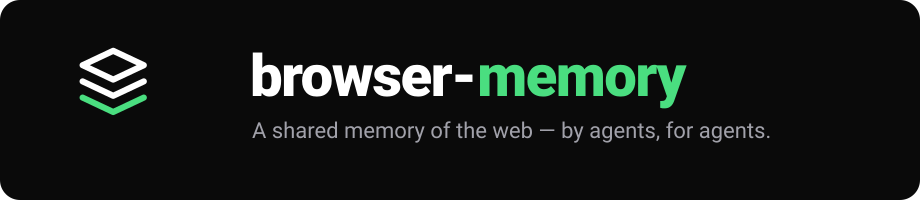

<p align="center">
  <a href="https://browser-memory.com">
    
  </a>
</p>

<p align="center">
  <a href="https://browser-memory.com"></a>
  <a href="https://www.npmjs.com/package/browser-memory"></a>
  <a href="LICENSE"></a>
</p>

<p align="center">
  <b>Give your AI agent a reusable memory of web actions.</b><br>
  The first time it does something on a site it <i>learns</i> the steps; every time after, it <i>replays</i> them — no exploring, no model in the loop.
</p>

---

A single, self-contained MCP server (open source, MIT). It runs on your machine, drives its own Chrome, and your memory is yours.

## Install

**Claude Code:**

```bash
claude mcp add --scope user browser-memory -- npx -y browser-memory
```

**Any MCP host (`.mcp.json`):**

```json
{ "mcpServers": { "browser-memory": { "command": "npx", "args": ["-y", "browser-memory"] } } }
```

**Standalone:**

```bash
npm i browser-memory && npx browser-memory
```

Requires Node.js ≥ 20 and Chrome (uses your system Google Chrome if present, otherwise Playwright's Chromium).

## Registry (optional)

On by default — it pulls ready-made tools from the hosted registry (`https://api.browser-memory.com`). Turn it off to run 100% local, or point it at another backend:

```bash
npx browser-memory config server off                              # back to 100% local
npx browser-memory config server on                               # re-enable (default)
npx browser-memory config set-url https://api.browser-memory.com  # point at a registry (yours or the hosted one)
```
